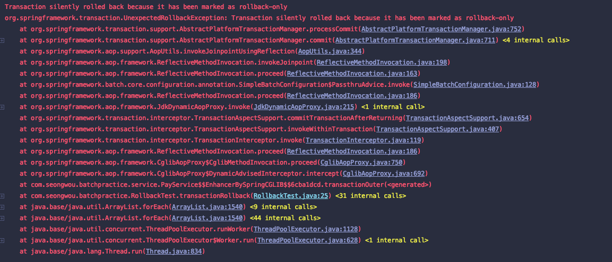

최근 프로젝트를 진행하며 Spring에서의 Transaction 관리 방법을 몰라서 겪었던 어려움이 있었다.  

## @Trasactional

보통 스프링에서 지원하는 어노테이션 방식 `@Transactional`을 선언하여 사용하는 방법이 일반적이고, 이를 선언적 트랜잭션이라 부른다.  

Class나 Method위에 해당 어노테이션을 추가하면, 트랜잭션 기능이 적용된 프록시 객체가 생성된다.  

## PlatformTransactionManager  

트랜잭션은 `PlatformTransactionManager` 인터페이스를 통해 추상화되었다.  
스프링 트랜잭션 처리의 중심이 되는 인터페이스이며 다양한 환경과 제품에 대응하는 구현 클래스를 재공한다.  

`JpaTransactionManager`  JPA로 데이터베이스에 접근하는 경우에 이용한다.  

## 문제 발생

서비스 로직을 하나 구현해야했었고, 해당 기능은 파일을 데이터 단위로 읽는 루프를 돌아 데이터를 하나씩 저장하는 로직을 포함하고 있었다.  

아래는 당시 상황을 재현한 예시이다.  

```java

    for (Pay pay: payList) {
        try {
            payRepository.save(pay);
            successCount++;
        } catch (Exception e) {
            failCount++;
            log.error(e.getMessage(), e);
        }
    }

```  

루프문 안에서 `Exception`을 처리하여 실패하여도 다음 데이터 저장을 이어갈 수 있도록하는 로직을 테스트하던 중 문제가 발생했다.  



처음에는 이게 롤백되는건지 알수가 없었고, try catch와 다른 방식으로 Transaction부에 noRollbackFor 로 Exception.class를 선언하여도 똑같은 오류만 뱉을 뿐이었다.  

제가 알지 못하는 Spring의 Transaction관리 방식이 있을 것이라는 생각에 transaction 관련된 로그를 분석하기 시작했고,  

로그를 통하여 파일의 데이터를 저장하는 JpaRepository save 메서드에서 새로운 트랜잭션으로  기존의 트랜잭션에 참여한다는 것을 발견했다!  

```log  
[    Test worker] o.s.orm.jpa.JpaTransactionManager        : Participating in existing transaction
```


AbstractPlatformTransactionManager 의 globalRollbackOnParticipationFailure 속성에 대하여 알게되었고 "Set whether to globally mark an existing transaction as rollback-only after a participating transaction failed."  이라는 문구를 발견했다.  

해당 속성은 default가 true였기에 참여하였던 save메서드에서 exception이 발생하면 롤백되었던 것이었다.  

## 해결  

이 문제를 해결하기위하여 해당 속성을 false로 바꾸는것은 위험부담이 너무 크다는 생각이 있었고, 결국 save 메서드를 감싸는 새로운 service 메서드를 만들어서 propagation = Propagation.REQUIRED 를 선언해 줌으로서 해당 문제를 해결할 수 있었다.  

```java

@Service
@Slf4j
@RequiredArgsConstructor
public class NewTransactionWrapper {

    private final PayRepository payRepository;

    @Transactional(propagation = Propagation.REQUIRES_NEW)
    public Pay savePay(Pay pay) {
        return payRepository.save(pay);
    }
}


```  

```java  
        for (Pay pay : payList) {
            try {
                newTransactionWrapper.savePay(pay);
                successCount++;
            } catch (Exception e) {
                failCount++;
                log.error(e.getMessage(), e);
            }
        }
    }
```  


